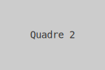

# Exemple de Llosa: `00.01.001`

Aquesta pàgina és una demostració tècnica de com es visualitzarà una llosa al wiki.

---
### **Metadades de la Llosa**
*   **ID:** `00.01.001`
*   **Títol:** Llosa d'Exemple Tècnic
*   **Dependències:** Cap

---
### **Contingut Pictogràfic**

A continuació es mostra la seqüència de pictogrames. Cada imatge és un arxiu SVG independent.

| Quadre 1: El Concepte A | Quadre 2: El Concepte B |
| :---: | :---: |
|  |  |

### **Descripció dels Passos**

1.  **Primer Pas:** El primer pictograma representa una acció o un objecte inicial. Està definit en un arxiu SVG separat per a la seva reutilització i edició.
2.  **Segon Pas:** El segon pictograma mostra l'evolució o el resultat de l'acció. La disposició en taules ens permet crear seqüències visuals clares.

### **Com col·laborar en aquesta llosa?**

Si creus que aquests pictogrames no són clars o tens una idea millor, el procés és:
1.  Anar a la secció **[Issues del projecte](https://github.com/Projecte-Arca/wiki/issues)**.
2.  Obrir una nova "Issue" utilitzant la plantilla "Reportar un Error o Suggerir una Millora".
3.  Descriure el teu canvi proposat. La comunitat ho discutirà allà.

[Tornar a l'inici](../README.md)
